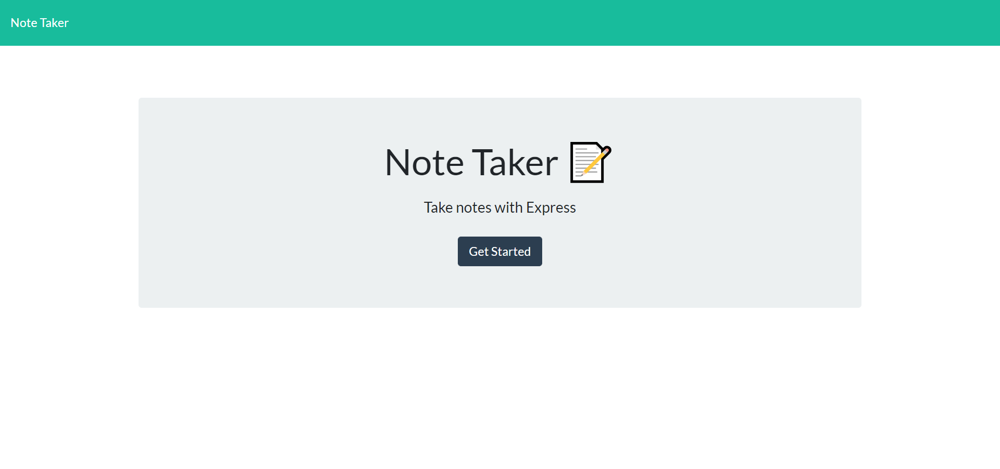
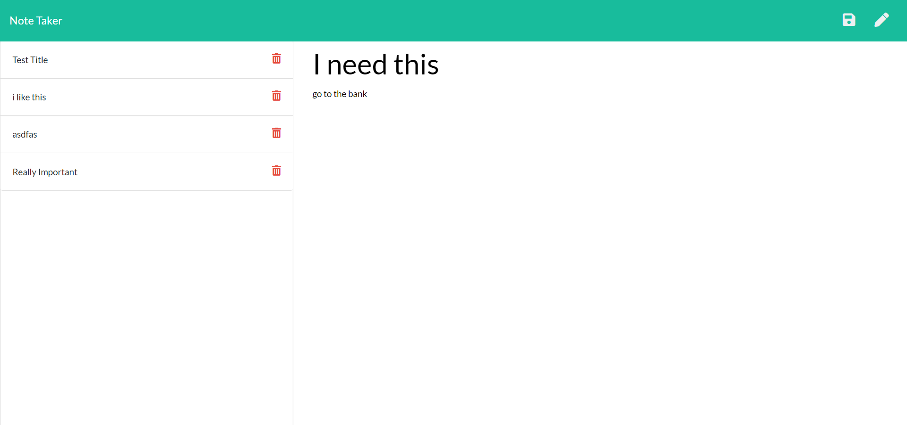

# Note Taker Application

## Description

This application creates, displays, and retrieves notes in an organized way.

## Table of Contents

* [Installation](#installation)
* [License](#license)
* [Contributing](#contributing)

## Installation

Depoloyed live at:

https://jim-note-taker.herokuapp.com/

front-end deployed at GitHub: https://github.com/1hoppy1/Note-Taker

If you clone the code, on your Command Line Interface you will need to type "npm install" to get the modules for the app to work.
Then, type "npm start" to have the local host server listen to port 3001.
Then, on your web browser got to "http://localhost:3001/

## License

None

## Contributing

If you have any questions, comment, concerns, or would like to contribute to this project, please email me at j@hotmail.com. Thanks!